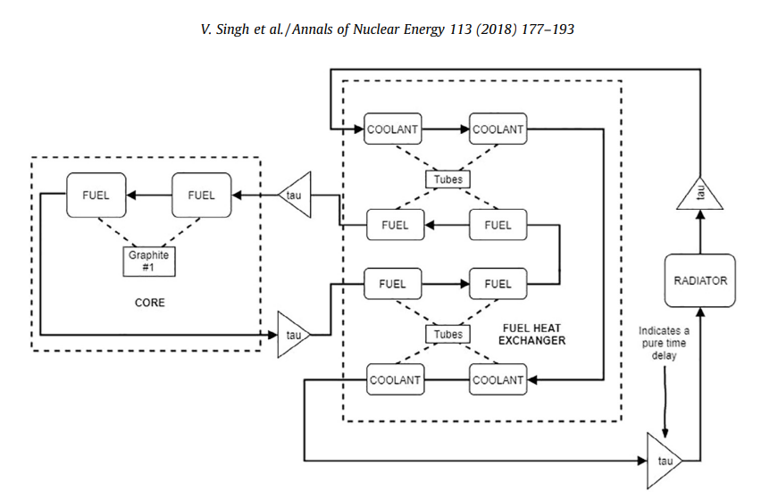

# Model
Non-linear dynamic model of the MSRE based on [Singh et al.](https://www.sciencedirect.com/science/article/pii/S030645491730381X). The model uses a "nodalized" approach, in which the reactor system is composed of coupled subsystems, each of which contain multiple nodes to represent the various dynamics contributing to neutron density (reactor power) and heat transfer. This model is a replication of the one-region nodal model implemented in Singh et al. A schematic of the nodes is shown below 



## Kinetics 
The neutron kinetics are expressed in terms of fractional power. As described in Singh et al., "The premise is that reactor power is proportional to neutron density, with all other parameters held fixed." In the model herien, kinetics are described by the following set of equations

```math
\begin{equation}
\frac{{dn(t)}}{{dt}} = \frac{{(\rho(t) - \beta)}}{\Lambda} n(t) + \sum_{{i=1}}^6 k_i C_i(t) + S(t)
\end{equation}
```

where $S(t)$ is an external source term, and $C_i(t)$ is the concentration of the $i^{th}$ precursor group (six total for this model) with

```math
\frac{dC_i(t)}{dt} = \frac{\beta_i}{\Lambda}n(t)-\lambda_i C_i(t) - \frac{C_i(t)}{\tau_C} + \frac{C_i(t - \tau_L) e^{-\lambda_i \tau_L}}{\tau_C}
```

where $\rho(t)$ is the total reactivity such that 

```math
\rho(t)=\rho_0+\rho_{fb}(t)+\rho_{ext}
```

where $\rho_0$ is the reactivity necessary for steady state operation, found by solving the above two equations in the steady state, which yields

```math
\rho_0 = \beta - \sum_{i=1}^6 \frac{\beta_i}{1+\frac{1}{\lambda_i \tau_C}(1-e^{-\lambda_i \tau_L})}
```

and $\rho_{ext}$ is external reactivity, e.g. from a reactivity insertion, and $\rho_{fb}$ is the feedback reactivity due to temperature differences in the core nodes, expressed as 

```math
\rho_{fb}(t) = \alpha_f \sum_{i=1}^{n} I_{fi} (T_{f,0} - T_f(t)) + \alpha_g \sum_{i=1}^{n} I_{gi} (T_{g,0} - T_g(t)), \quad \text{where} \sum_{\text{regions}} I_{fi} = \sum_{\text{regions}} I_{gi} = 1.0
```

where $\alpha_f$ and $\alpha_g$ are the fuel and graphite temperature-reactivity coefficients respectively, and $I$ represents the weighted nuclear importance factor of each region.

The kinetics are coupled to the heat exchanger node via the feedback reactivity, $\rho_{fb}(t)$, which depends on the temperature of the fuel and graphite nodes, which ultimately depend on the fuel inlet temperature. Note, the differential equation govenring neutron density, $\frac{dn(t)}{dt}$, is nonlinear due to the fact that $n(t)$ is multiplied with $\rho(t)$.

## Heat Transfer 

The equations governing heat transfer contain three terms; a source term and a sink term, occuring from either mass transfer (1D flow) or conduction via wetted interface, as well as a fractional power generation term, which is zero at all nodes outside of the core. The equations governing the two core fuel nodes are, for example

```math
\frac{dT_{f1}}{dt} = \frac{W_f}{m_{f1}}(T_{f_{in}}-T_{f1}) + \frac{K_1 P_0 (\frac{n}{n_0})}{m_{f1} C_{pf}} + \left( \frac{K_{g1}}{K_{g1}+K_{g2}} \right) \frac{hA_{fg}}{m_{f1}C_{pf}}(T_g - T_{f1})
```
```math
\frac{dT_{f2}}{dt} = \frac{W_f}{m_{f2}}(T_{f1}-T_{f2}) + \frac{K_2 P_0 (\frac{n}{n_0})}{m_{f2} C_{pf}} + \left( \frac{K_{g2}}{K_{g1}+K_{g2}} \right) \frac{hA_{fg}}{m_{f2}C_{pf}}(T_g - T_{f1})
```
"Here, $W_f$ is the mass flow rate of fuel salt, $m_{f1}$ and $m_{f2}$ represent the mass of fuel nodes 1 and 2 respectively, $C_{pf}$ represents the fuel salt specific heat capacity, $K_1$ and $K_2$ are the fraction of total power generated in fuel nodes 1 and 2, $K_{g1}$ and $K_{g2}$ represent the fraction of power generated in the graphite transferred to each fuel node, $hA_{fg}$ is the product of area and heat transfer coefficient for the fuel-graphite interface, $P_0$ is the nominal power which multiplied with fractional neutron density n/no gives the instantaneous power, and the $T$s represent the temperatures of the various nodes. Note that the direction of heat transfer depends on the instantaneous temperature of the various nodes." (Singh et. al). 

## Method
The model herein uses SciPy's ODE library. Sample implementation is shown below:

```python
backend = 'dopri5'
r = ode(dydtMSRE).set_integrator(backend,max_step=0.10)
r.integrate(100.00)
```

However, since SciPy's ODE library does not support delay differential equations, the delay terms are stored and handled manually. Since the 'dopri5' method uses adaptive time-stepping, linear interpolation is used for approximating the value of the delay terms near the closest timestep to the delay. 
